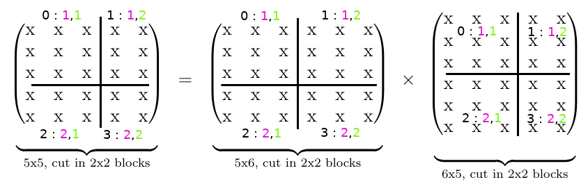
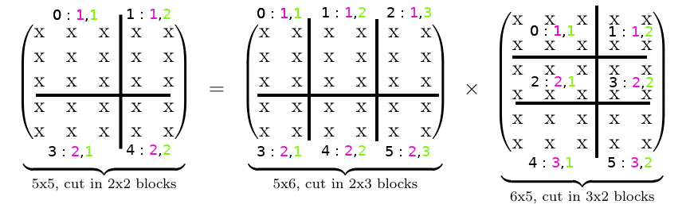

# Parallel-Linear-Algebra-Routines
In this repository are some tools for parallel linear algebra routines using both C/C++ and MPI.

## Parallel Block Matrices Multiplication

Multiplication of two matrices A and B by scattering them in multiples block matrices are well suited for parallelism.

Below is explained the different step of this method : 

#### 1) Scatter Matrices A and B into multiple blocks

In each thread will be allocated a corresponding part of *A* and *B* called *A_block* and *B_block*, respectively, according to the thread's *rank*. The game of this first step is to find the perfect maner to scatter *A* and *B* in blocks, following their row and column dimensions.

The tasks given to the different thread must be well balanced to achieve good performances. Indeed, having only one thread doing all the job is the same as runing the code on a single thread. The decomposition in blocks depends on the number of thread given as parameter, and need to be thought considering a good balance between the different thread.

A good method for that is to compute the euclidian division of matrices' number of row by the number of block placed on a row. The remainder should be distributed accross blocks starting from the first block on the left hand corner. For example, let the number of thread fixed to 4, and a matrix 5x5 to be scattered in blocks. Now let the number of block per row to 2. The euclian division of 5 by 2 is 2 with a remainder egal to 1. Each blocks placed on rows will receive 2 columns, and the remainder will be attributed to the first block. The process is strictly for columns.

Here is an illustration of this process :


Since matrices multiplication of *A* and *B* involves that the number of column of *A* is egal to the number of row of *A*, the number of block per column in *A* should be egal to the number of block per row in *B*.

An issue occurs when the square root of the number of thread is not a natural number. In that case, the number of block per row and colmun are not egals. Since the number of block per column in *A* should be egal to the number of block per row in *B*, the number of block of the final matrix *AB* is different to the number thread allocated.

This problem is illustrated below : 



This is particulary inconvenient for creating good communicators with MPI. 

While communicators are easy to design in the case where the square root of the number of threads is an integer, I found this situation particularly hard to handle at this point.

So my compromise was to work with a number of thread having an natural square root such as 4,9,16,25,etc.


#### 2) Compute each block 

```cpp
    int I = (int)(rank/(int)sqrt(nbProcess)) + 1;
    int J = (rank%(int)sqrt(nbProcess)) + 1;
    
    /*Each block is defined by its position in matrices, 
    since the square root of the number of thread is an integer, 
    each block has the same position in each matrix.*/
    
    MPI_Comm COMM_ROW;
    MPI_Comm COMM_COL;
    
    MPI_Comm_split(MPI_COMM_WORLD,J,I,&COMM_COL);
    MPI_Comm_split(MPI_COMM_WORLD,I,J,&COMM_ROW);
    
    //Initialization of rows and columns communicators
    
    int ncolBlockAnrowBlockB_temp; /
    *The number of columns and rows of the different A_blocks and B_blocks passed and recevied can 
    vary according to the position of blocks*/
    
    double **A_block_temp;
    double **B_block_temp;
    
    double **AB_block = init_contiguous_matrix(nrowBlockA,ncolBlockB);
        
    for(int k = 1;k<(int)sqrt(nbProcess)+1;k++){
        
        if(k==I){
            
            B_block_temp = init_contiguous_matrix(ncolBlockA,ncolBlockB);
            matrix_copy(B_block_temp,B_block,ncolBlockA,ncolBlockB);
            ncolBlockAnrowBlockB_temp = ncolBlockA;
        }
        
        MPI_Bcast(&ncolBlockAnrowBlockB_temp,1,MPI_INT,k-1,COMM_COL);
        //Broadcast B_block across the column
        
        if(k!=I) B_block_temp = init_contiguous_matrix(ncolBlockAnrowBlockB_temp,ncolBlockB);
        
        MPI_Bcast(&(B_block_temp[0][0]),ncolBlockAnrowBlockB_temp*ncolBlockB,MPI_DOUBLE,k-1,COMM_COL);
        
        if(k==J){
            
            A_block_temp = init_contiguous_matrix(nrowBlockA,ncolBlockA);
            matrix_copy(A_block_temp,A_block,nrowBlockA,ncolBlockA); //Idem
            ncolBlockAnrowBlockB_temp = ncolBlockA;
            
        }
        
        MPI_Bcast(&ncolBlockAnrowBlockB_temp,1,MPI_INT,k-1,COMM_ROW);
        
        if(k!=J) A_block_temp = init_contiguous_matrix(nrowBlockA,ncolBlockAnrowBlockB_temp);
        
        MPI_Bcast(&(A_block_temp[0][0]),nrowBlockA*ncolBlockAnrowBlockB_temp,MPI_DOUBLE,k-1,COMM_ROW);
        //Broadcast A_block across the row
        
        for(int i = 0;i<nrowBlockA;i++){
                for(int j = 0;j<ncolBlockB;j++){
                    for(int l = 0;l<ncolBlockAnrowBlockB_temp;l++){
                        AB_block[i][j] += A_block_temp[i][l]*B_block_temp[l][j];
                    }
                }
        }
        clean_contiguous_matrix(A_block_temp,nrowBlockA,ncolBlockAnrowBlockB_temp);
        clean_contiguous_matrix(B_block_temp,ncolBlockAnrowBlockB_temp,ncolBlockB);
    }
    
    return AB_block;
}
```

#### 3) Gather the computed blocks into the final matrix AB

In coming ...

### Prerequisites
* MPIC++
* MPIEXEC
* Electricity

### Install MPI on Ubuntu / Debian

```shell
sudo apt install mpich
```

### Compilation

Clone the git project with : 
```shell
git clone https://github.com/Protoniac/Parallel-Linear-Algebra-Routines.git
```
Compile and execute :

```shell
mpic++ -c *.cpp -Wall
mpic++ -o main *.o -Wall
mpirun -n NUMBEROFTHREAD ./main
```
The square root of the number of thread given as parameter should be a nutural number.

If the above commands are not working, it might be possible that the symobolic links have not been created properly.

```shell
ln -s /usr/bin/mpic++ mpic++
ln -s /usr/bin/mpirun mpirun
```

Generate NxM matrix :
```shell
cd matrix_samples
python matrix_generator.py N M 1
```
